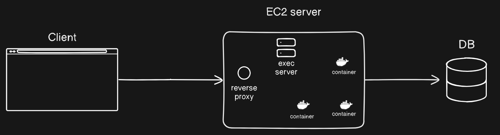

# Codedman Playground clone

## Description
Codedamn Playground Clone is a web application that allows users to create projects and use an online IDE to edit or run their code. It features auto-scaling capabilities according to the load, ensuring optimal performance, and each user will have a separate environment for running their code, guaranteeing isolation and security.





## Tech Stack

- **Next.js:** client-side rendered and static web applications
- **Express:**  Backend API.
- **Docker:** Platform for containerization used to package applications and dependencies.
- **S3:** Object storage service used for storing code.
- **Postgres**: Database to store user details 


## Prerequisites:
- Node.js 
- Docker 
- s3 
- Postgress
  
Create a public S3 bucket and upload some starter code for React or Node.js in the 'baseCode/${language}' folder.


## Steps To Run Locally
### using Docker

1. checkout to dev branch
```
git checkout dev
```

2. fill out the env values in docker-compose file and start the service  
```
docker compose up 
```

3. Access the Application:
```
http://localhost:3000
```


### Manual Setup
1. Clone the Repository:
```
git clone https://github.com/DkDeepak001/codedamn-project
cd replit
```
2. Install Dependencies:
```
npm install
```

4.Create a webhook for user signup in clerk:
```
${app_url}/api/user
```
select user event when creating webhook


5. Access the Application:
```
http://localhost:3000
```

## Contributing
Contributions are welcome! Feel free to open an issue or submit a pull request


